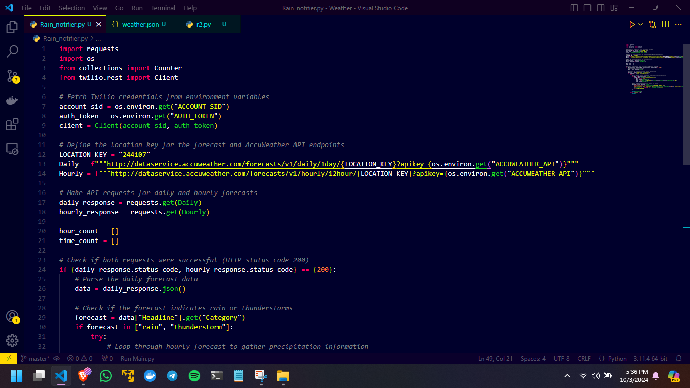
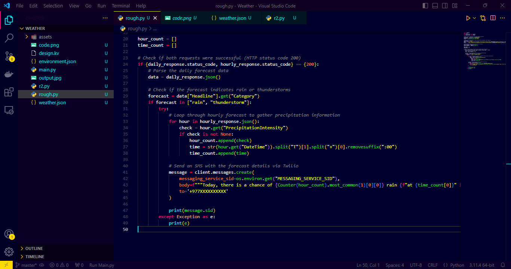
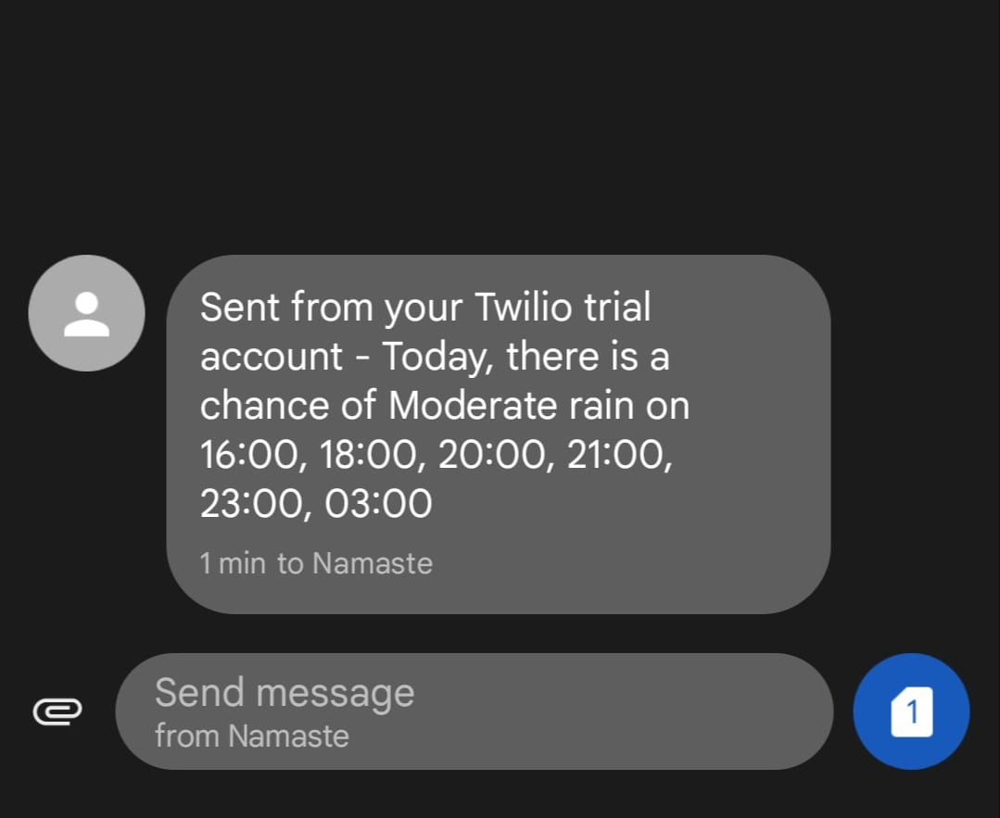

# Rain-Notifier using Python
This project is a Python script that fetches real-time weather data from the AccuWeather API and sends SMS alerts using Twilio. It checks for specific weather conditions (like rain or thunderstorms) and sends a notification if detected.

Here are the screenshots of the code and the output:

*First part of the script that handles API requests and data processing.*

*Second part of the script that sends SMS notifications based on the weather data.*

*Example output showing the notification sent for weather alerts.*

Feel free to give Feedback!
